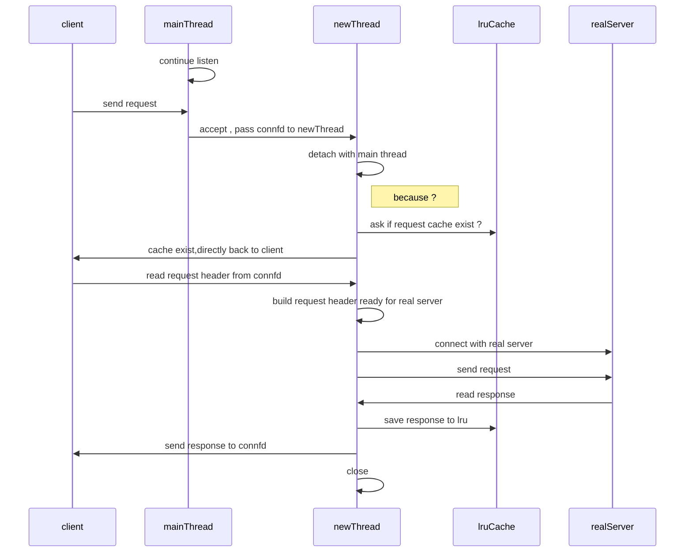

断断续续地做完了 proxy lab,做一下回顾

# CSAPP Proxy Lab 总结

proxy lab 比起 shell lab 要简单一些,没有太多繁琐的细节问题,如果用 Go 的网络库来写的话估计更轻量,抽象程度更高

HTTP 格式的解析在书本的 tiny server 有参考代码, 用 C 写减少了很多拷贝动作

## 大体功能

主要实现的功能是将 client 发来的 HTTP 请求解析, 从请求行`GET www.baidu.com HTTP/1.1` 
获取目标 server , 然后与 server 建立连接 ,获得响应后发回给 client

## 实现细节

CSAPP 书中描述了三种并发模型 , 多进程,多线程和事件循环

这里使用了线程模型,并且预生成固定线程, 从 sbuf (一个类似 golang channel 的实现) 里互斥取已连接的 client fd 进行处理

P / V 信号量 , 可以等待! 不需要自己去轮询获取锁和查询是否有 item

连接部分和 uri 解析ip:port部分参考 tiny server 对 linux 库函数的进一步封装

描述符数据结构部分,太乱了,感觉是历史遗留问题,直接用封装好的

## 并发模型
三个并发模型的优劣

多进程: 

- 缺点:各种开销大,如创建进程,进程控制,IPC
- 共享文件表,要注意各自关闭描述符,避免内存泄漏
- 有独立的地址空间 , 减少互相覆盖的风险

IO 多路复用(事件驱动):

- 性能比其他两个有明显的优势
- 可控性更高, 调度权在自己手里
- 单一进程,方便调试
- 缺点:编码比其他的复杂 
- 缺点:无法充分利用多核 (参考 nginx等中间件, 将事件分派到各个进程 多进程/多线程+IO 多路复用)

多线程:

- 共享地址空间,包括代码,数据,堆,共享库,打开的文件,通信成本低
- 上下文切换比多进程快
- 共享变量并发问题较多 (使用信号量同步/互斥)
- 可重入问题 , 可重入函数(不引入任何共享变量)

## 资料
[15-213 recitation](https://www.youtube.com/watch?v=eQNhD7w7XrY&t=3s)

csapp 第三版最后三章

参考 tiny 目录的 tiny httpserver

[csapp labs](http://csapp.cs.cmu.edu/3e/labs.html)

## 后续

在 proxy 这一层还可以加功能,如缓存,使用 LRU Cache 对每个 GET uri 缓存

## 梳理的流程

