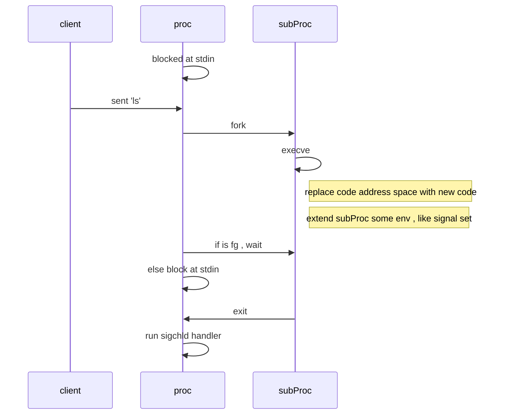
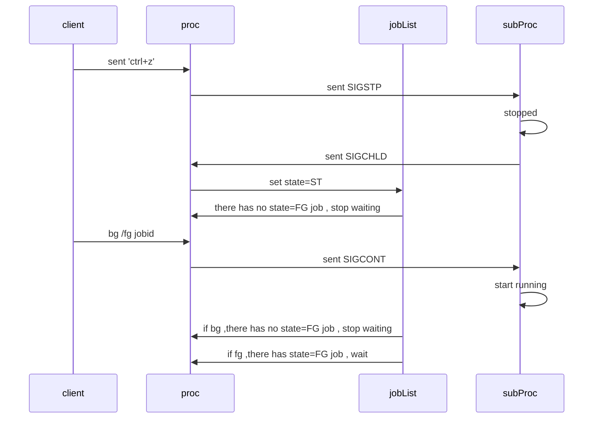
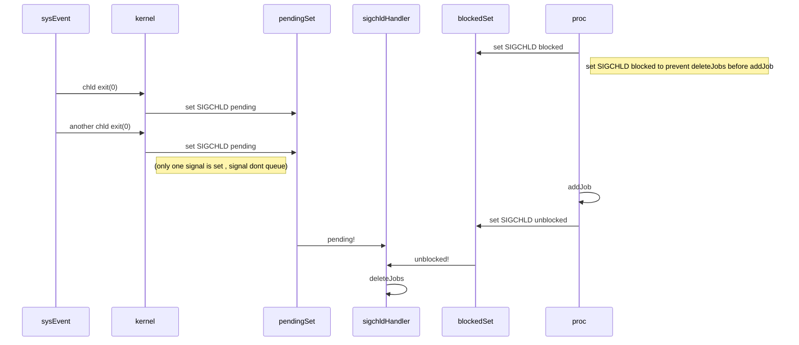

断断续续地做完了 shell lab,做一下回顾

# CSAPP Shell Lab 总结

还是花了不少时间,尤其是信号那部分,看了不少资料,才知道了linux 是用一个二进制位集合存储的各个信号的状态,因此信号是不能排队的,所以在收到 SIGCHLD 的时候要尝试 waitpid 收割多个子进程

命令解析部分,老师已经给写好了~~ 我们需要实现的是

- 几个内建命令 (bg,fg,quit,&,jobs)

- 外部命令的执行 (fork 子进程后 execve 执行)

- Job 和子进程 的管理
- 信号处理 (子进程发的, 使用者发的 ctrl+c , SIGSTP ...)

一些要注意的点

- 前台运行和后台运行的区别 : 主进程是否 waitpid

- 父进程 blocked 了SIGCHLD 后,子进程 fork 后要立即取消 blocked (继承了父进程的 blocked 集合) , 这样子进程才能收到子进程的子进程发出的 SIGCHLD 信号

- 前后台运行的进程输出流都继承了父进程的 stdout fd

- 执行 ls 后执行 ps , ls 变成 defunct (僵尸进程) , 因为父进程没有回收 , 此时只能等父进程退出后由init 进程来回收了,没有退出之前一直会占用着资源

- 信号是不排队的 , sigchld只回收了一个进程 , 也产生僵尸进程

- 没有对 execve 不存在的进行判断 ,子进程跳过 execve 继续执行 tsh 剩余代码, 成了 tsh 套娃

   

  

- 未修改子进程的 pgid , 导致后台进程也收到信号被杀掉了 (trace07 子进程需要脱离进程组, 否则所有子进程都会被杀掉)

- Sigchld handler 和主进程之间是异步的(并发问题) , 如果 deleteJob 在 addjob 之前执行会出问题

## 流程

用 mermaid 画了一下图

### 执行命令的主流程 

### 暂停,前后台切换流程

### 信号处理流程 , 信号进程的并发竞争问题, 信号没有排队机制

## 资料

`shell lab`的 `README.pdf` 和 `CSAPP 第八章`

[recitation shell lab](https://www.youtube.com/watch?v=kC8uW4bS_MM&list=PLLchAlP_W0GfYWjv6Off6lfk4xNe_l-QB&index=13&t=6s)

[cs35实验环境配置 test1-3](https://www.youtube.com/watch?v=OMhhyGUQ5BI&list=PLLchAlP_W0GfYWjv6Off6lfk4xNe_l-QB&index=10&t=4s)

[shell lab debug -gdb](https://www.youtube.com/watch?v=xAW_pNBlfnI&t=1266s)

[shell lab hd](https://www.youtube.com/watch?v=CJDKTaXLK6s&t=2400s)

[what are double pointer in c](https://www.youtube.com/watch?v=jUcqT37FdUI&list=PLLchAlP_W0GfYWjv6Off6lfk4xNe_l-QB&index=42&t=460s) 

## 常用命令

`make clean ; make`

`quit ,bg,fg,&,jobs :built-in command`

`myspin 3 : sleep for n second`

use tshref as a reference shell 

`make test01 02 .... : tsh`

`make rtest01 02  : tshref`

## 工具

gdb /clion /cgdb

strace

man page (查阅系统调用函数, 查阅命令使用)

## 调试

调试方法看了 [youtube 这个作者](https://www.youtube.com/watch?v=xAW_pNBlfnI&t=1266s)的方法,总结了一些功能

`gdb ./tsh`  

`/bin/ls`

`run`

`n`  next 的缩写

`s`  step into

`ctrl+c` 回到 gdb (SIGINT 会被 gdb 拦截, tsh 不会收到)

`layout` 展示代码界面

`list sigint_handler`

`signal SIGINT` , 发信号到 tsh

`break eval` 在 eval 函数下断点 , 执行到断点处, 那一行不会被执行

`c`  continue (back to tsh)

`p` cmdline 打印 cmdline 变量

`break sigchld_handler`

`bt` 打印 backtrace

`frame`

`call fgpid(jobs)` 可以实时调用函数!  (clion 的 evaluate expression 好像也可以)

`set detach-on-fork off` ,  (gdb进入子进程 并暂停子进程)

`info inferiors`  (list of current being controled process by gdb)

`Inferior 3` 进入某个process

`finish` 跑到结束 or breakpoint

`info proc` 查看当前进程信息

`detach inferior 3` 放弃控制该进程

`info break`  断点列表

`delete 1`  delete breakpoint